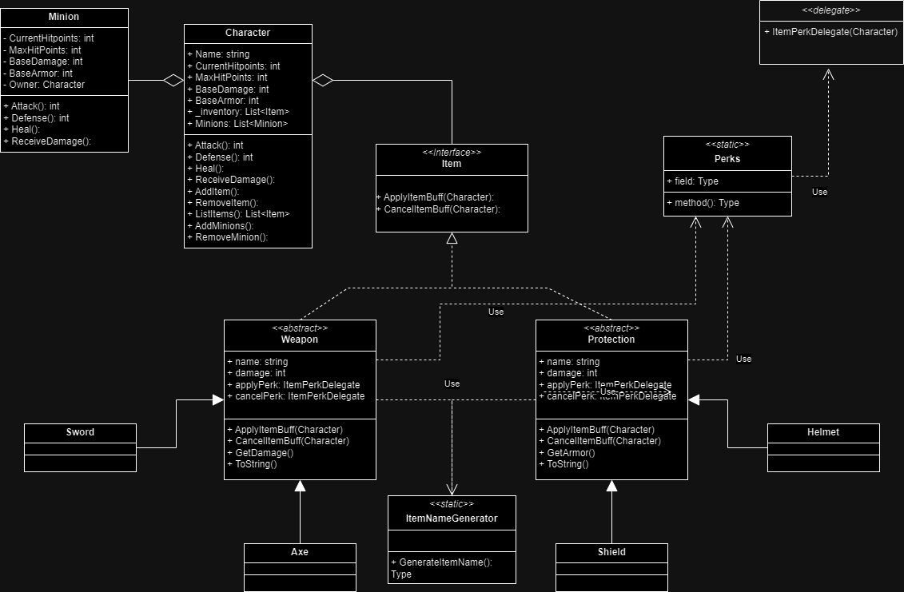

# Diagrama UML de un Sistema de Personajes y Objetos

## 1. Clases principales
### Character (Personaje)
La clase Character representa a un personaje en el juego, que puede poseer objetos y minions.
* Atributos:

  * `Name`: nombre del personaje.
  * `CurrentHitPoints`: puntos de vida actuales.
  * `MaxHitPoints`: puntos de vida máximos.
  * `BaseDamage`: daño base que puede infligir.
  * `BaseArmor`: armadura base del personaje.
  * `_inventory`: lista de objetos que posee el personaje.
  * `Minions`: lista de minions que están bajo el control del personaje.
  
* Métodos:

  * `Attack()`: devuelve el daño del personaje.
  * `Defense()`: devuelve la defensa del personaje.
  * `Heal()`: recupera puntos de vida.
  * `ReceiveDamage()`: recibe daño.
  * `AddItem()`: añade un objeto al inventario del personaje.
  * `RemoveItem()`: elimina un objeto del inventario.
  * `ListItems()`: lista los objetos en el inventario.
  * `AddMinion()`: añade un minion al personaje.
  * `RemoveMinion()`: elimina un minion del personaje.
  
### Minion (Esbirro) 
El Minion es un tipo de entidad que puede ser generada por objetos, una vez obtenido un minion solo se puede eliminar si muere.

* Atributos:
  
  * `CurrentHitPoints`: puntos de vida actuales del minion.
  * `MaxHitPoints`: puntos de vida máximos del minion.
  * `BaseDamage`: daño base que el minion puede infligir.
  * `BaseArmor`: armadura base del minion.
  * `Owner`: personaje al que pertenece el minion.
    
* Métodos:

  * `Attack()`: devuelve el daño del minion.
  * `Defense()`: devuelve la defensa del minion.
  * `Heal()`: el minion se cura.
  * `ReceiveDamage()`: el minion recibe daño.
    
## 2. Interfaz y Clases Abstractas
### Item (Objeto)
Item es una interfaz que define los comportamientos básicos de los objetos en el juego.

* Métodos:
  * `ApplyItemBuff(Character)`: aplica una mejora (buff) al personaje.
  * `CancelItemBuff(Character)`: cancela la mejora aplicada.
  
### Weapon (Arma)
La clase abstracta Weapon hereda de Item y define las características de las armas.

* Atributos:

  * `name`: nombre del arma.
  * `damage`: daño que causa el arma.
  * `applyPerk`: delegado que aplica un beneficio del arma.
  * `cancelPerk`: delegado que cancela un beneficio del arma.
    
* Métodos:

  * `ApplyItemBuff(Character)`: aplica una mejora al personaje cuando el arma está equipada.
  * `CancelItemBuff(Character)`: cancela la mejora cuando el arma se desequipa.
  * `GetDamage()`: devuelve el daño del arma.
  * `ToString()`: devuelve una representación del arma como texto.
  
### Protection (Protección)
La clase abstracta Protection también hereda de Item y representa objetos de protección (armadura, escudos, etc.).

* Atributos:

  * `name`: nombre del objeto de protección.
  * `damage`: cantidad de protección o armadura.
  * `applyPerk`: delegado que aplica un beneficio de la protección.
  * `cancelPerk`: delegado que cancela un beneficio de la protección.
  
* Métodos:

    * `ApplyItemBuff(Character)`: aplica una mejora al personaje cuando el objeto de protección está equipado.
    * `CancelItemBuff(Character)`: cancela la mejora cuando se desequipa.
    * `GetArmor()`: devuelve el nivel de protección.
    * `ToString()`: devuelve una representación del objeto de protección como texto.
      
## 3. Herencia de Clases Específicas
### Espadas y Hachas (Sword y Axe)
Las clases Sword (Espada) y Axe (Hacha) heredan de Weapon. Estas clases representan tipos específicos de armas, cada una con atributos y comportamientos específicos que heredan de la clase abstracta Weapon.

### Escudos y Cascos (Shield y Helmet)
Shield (Escudo) y Helmet (Casco) son clases que heredan de Protection. Representan tipos de protección que un personaje puede equipar.

## 4. Delegates y Perks
### ItemPerkDelegate
Un delegate que define un método que aplica o cancela un beneficio (perk) sobre un personaje. Este delegate es usado por las clases Weapon y Protection para añadir o quitar efectos en el personaje.

### Perks (Mejoras)
La clase Perks es estática y contiene atributos y métodos que definen diferentes tipos de mejoras que pueden aplicarse a los personajes a través de los objetos.

## 5. Generador de Nombres
### ItemNameGenerator
Una clase estática que genera nombres para los objetos en el juego. Contiene el método GenerateItemName() que devuelve un tipo específico de nombre para los objetos (como las armas o protecciones).

## 6. Relaciones
* La clase Character tiene una relación de agregación con los Minions y Items, lo que significa que un personaje puede tener varios minions y objetos.
* Las clases Weapon y Protection heredan de Item, representando que son tipos específicos de objetos en el juego.
* Los objetos de tipo Weapon y Protection utilizan ItemPerkDelegate para aplicar o cancelar beneficios sobre los personajes.
